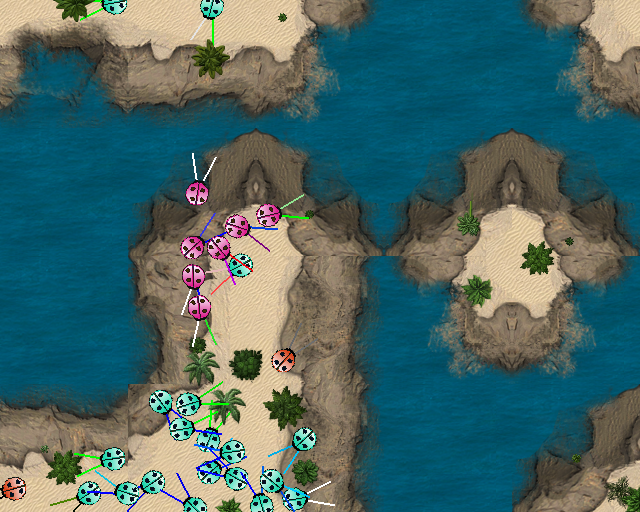
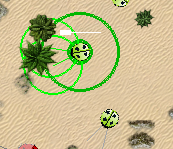
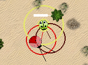
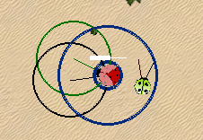
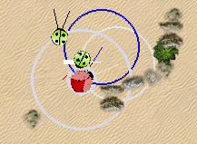

ALife (BugWorld) V0.60a
=======================

<!-- 
An 'artificial life' project in a simple 2D world, where emergent behaviour can arise. Unlike many similar, the creatures (they are *bugs*) here do not rely entirely on evolution to improve their behaviour generation-by-generation but use *reinforcement learning* in order to learn useful behaviours by experiences within one generation.
--> 

The ALife project began as one of many experiments in 'Artificial Life', in a 2D world, combining not only evolutionaly methods but also with other approaches in Reinforcement Learning. Recently the project is configured more for a more typical episode-based game-like environment with less emphasis on the evolutionary component (and more on the reinforcement learning side), but it is designed to be flexible and configurable in this aspect. 





Requirements
------------

ALife/BugWorld should work with Python 2 or Python 3, as long as you have the following libraries installed:
	
* [pygame](http://pygame.org/)
* [numpy](http://www.numpy.org)


Getting Started
---------------

If you have the requirements, then run, for example,

```
	python ALife.py
```

You can load a particular map as follows 

```
	python ALife.py ./dat/maps/map_nw_island.dat 
```

<!-- There are some maps in `./dat/maps/` which can be edited by hand in the text file. 
The number indicates the density of objects to be spawned on startup; 0 is none, 10 is a lot.
--> 

The following keys are available:

* <kbd>1</kbd> -	Add a new rock (under the mouse pointer)
* <kbd>2</kbd> -	Change the position of the 'flag' (to under the mouse pointer)
<!-- * <kbd>3</kbd> -	Add a new 'plant' (under the mouse pointer) -->
* <kbd>4</kbd> -	Add a new 'bug' (under the mouse pointer) agent type/team 1
* <kbd>5</kbd> -	... agent type/team 2
* <kbd>6</kbd> -	... agent type/team 3
* <kbd>7</kbd> -	... agent type/team 4
* <kbd>8</kbd> -	... agent type/team 5
* <kbd>9</kbd> -	... agent type/team 6
<!-- * <kbd>s</kbd> -	Save the agent of the currently selected bug -->  <!-- ('./dat/dna/')-->
<!-- * <kbd>l</kbd> -	Load creatures currently saved on disk --> <!-- ('./dat/dna/')-->

You may select an agent by clicking on it and thus viewing info (sensors, energy level, etc.) as well as taking control of it:

* <kbd>&uarr;</kbd> - Move the selected bug forward
* <kbd>&rarr;</kbd> - Turn the selected bug right
* <kbd>&larr;</kbd> - Turn the selected bug left

General controls:

<!-- * <kbd>&darr;</kbd> - Less energy input to the environment (less plant growth) -->
* <kbd>h</kbd> -	Toggle information and scoreboard
* <kbd>g</kbd> -	Toggle graphics (turn animation off for faster iterations, i.e., fast-forward)
* <kbd>d</kbd> -	Toggle grid (for debugging)
<!-- * <kbd>.</kbd> - More energy input to the environment (more plant growth) -->
<!-- * <kbd>,</kbd> - Less energy input to the environment (less plant growth) -->
* <kbd>-</kbd> - More frames per second
* <kbd>+</kbd> - Fewer frames per second

The bugs are animate agents, where input is in the form of three proximity sensors (two on each antennae plus the body as a third sensor) of three values each (representing RGB intensity) plus a value for the current energy level and a value giving the respective angle to the 'flag'. All range between 0 and 1. Two output actions indicate angle and speed. 

### Input

Under the bugs' 'vision' other bugs of the same team/species are blue, bugs from other species are red, plants are green, rock and impassable water is white. <!-- Each of the sensors varies from 0 to 1 representing the intensity of each color in the field of vision. --> Intensity depends on size and proximity and whether it is touching or not. A tenth input is the current energy level (also between 0 and 1).

This is illustrated in the following examples. Note that the colours get brighter and duller depend ending on proximity, and mix when more than one object is in the detection range (shown by the circles) for a particular sensor. The white bar represents the energy level.


<!--  -->


<!--  -->





### Output

The two dimensional output output is 1) change in angle in radians (e.g., $-\pi/4$ for a 45-degree left turn), and the speed ranges from -10 pixels/step in reverse to +10 moving forward. At values above +5, the bugs take flight and do not collide with anything (including rocks, water, and plants they need to eat). 


### Reward 

The reward function can be configured differently to evoke different behaviour from the bugs. 

<!-- The reward is the energy level difference with the previous time step. Energy is burned constantly according to size, and thus in the absense of eating there is a negative reward. Energy is also lost proportionally to the speed of movement and change in direction, collisions with rocks and other bugs, and so on. After a certain energy level, a bug automatically spawns a copy of itself, but this does not affect the reward. -->


Implementing New Agents
-----------------------

Add the path and classname of your agents to the `bugs` section in `conf.yml`. The agent should be in a class of similar style to [AIGym](https://gym.openai.com/docs/) and needs an `__init__` and `act` functions of the same style. Examples are given in `agents`. 

<!-- In this world, creatures also have a `spawn_copy` function which details how to copy itself when a bug reproduces (i.e., an evolutionary component). Even in non-evolutionary algorithms, this function can be used to add a variation to the hyper-parameters, and pass on existing knowledge. -->

<!-- If multiple agents are defined, multiple agents will be spawned randomly at the beginning. The more suited agents should eventually out-compete the others and be the only ones remaining, therefore it can be used to test different reinforcement learning algorithms against each other. -->


Using ALife Agents/Functions
----------------------------

You can install, with, e.g., 

	python3 setup.py develop


Known Bugs
----------

(Software bugs, not the bugs in the environment!)

* For some reason, on some systems with `python3` there is a long pause after the click when selecting a bug with the mouse pointer. 
* On some systems `python3` uses 100% CPU (when `python2` does not) for some reason 


Related Projects
----------------

Some related projects with some nice demos on YouTube:
 [1](https://www.youtube.com/watch?v=2kupe2ZKK58), 
 [2](https://www.youtube.com/watch?list=PLC9058E743A6155C1&v=1Jou4ggCFKQ), 
 [3](https://sites.google.com/site/scriptbotsevo/).


Notes on Graphics
-----------------

* Terrain obtained from from [Open Game Art](https://opengameart.org/users/chabull)
* Bug graphics from [Open Clip Art](https://openclipart.org/tags/ladybug)
