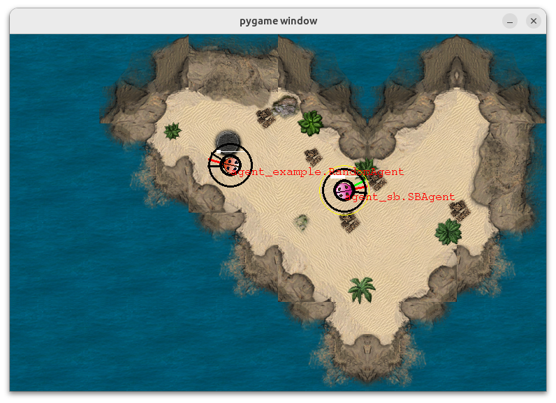

# ALife

ALife was originally conceived as a game, then an artificial life simulation (hence the name, ALife), then a `gym`-inspired testbed for reinforcement learning agents, then a multi-player MMORPG-style game with integrated server environment for scorekeeping, then (currently) just a standalone multi-agent PettingZoo environment. The server/networking architecture and agents are now maintained in separate projects, see TODO.git and TODO.git for hosting the environment, and connecting to one with an agent, respectively.



## Running

Quick start:
```
python run.py
```

This is a multi-agent PettingZoo environment. You can run it as per any other PettingZoo environment, see, e.g., TODO.git


##  'Gameplay'

An agent-controlled bug should find its way from its 'nest' to the 'flag', avoiding obstacles (including other agents), and consuming enough resources to sustain itself on its journey. The default observation space is 2-pixel RGB-color vision, plus some 'health/energy' level and a rough sensor indicating which way it is pointing in the map. Each dimension/variable is continuous, with a range between 0 and 1 (inclusive). Continuous action space is two dimensional (each between -1 and +1) with one being the angle and the other being the velocity, of the bug. 

All this can be changed with Wrappers. 


## Map Editing and Environment Design
 
To generate a new map, e.g., a 10x20 map called `new_4`: 
```
python3 -m alife.map_generator new_4 10 20
```
which will produce `new_4.map`. To edit the map:
```
python3 -m alife.map_editor alife/maps/new_4.map
```
TODO file selector?
TODO need to create `new_4.csv` if not already existent with minimal items

The following keys are available to edit a map:
TODO update

* <kbd>r</kbd> -	Add a new rock (under the mouse pointer)
* <kbd>p</kbd> -	Add a new plant (under the mouse pointer)
* <kbd>f</kbd> -	Change the position of the nest/flag (to under the mouse pointer) -- or add one if there is none
* <kbd>m</kbd> -	(Move) Change the position of the currently-selected object (to under the mouse pointer)
* <kbd>&uarr;</kbd> - Resize the selected object (rock, plant, flag, nest) -- bigger
* <kbd>&darr;</kbd> - Resize the selected object (rock, plant, flag, nest) -- smaller
* <kbd>&larr;</kbd> - Change the image of the object
* <kbd>&rarr;</kbd> - Change the image of the object
* <kbd>s</kbd> -	Save all inanimate sprites (rocks, plants, flag, nests) to the corresponding data file of the map


## Notes on Graphics

* Terrain obtained from [Open Game Art](https://opengameart.org/users/chabull) 
<!-- http://chabull.praire-chicken.com/index.html#work --> 
<!-- csaba felvegi -->
* Bug graphics from [Open Clip Art](https://openclipart.org/tags/ladybug)

